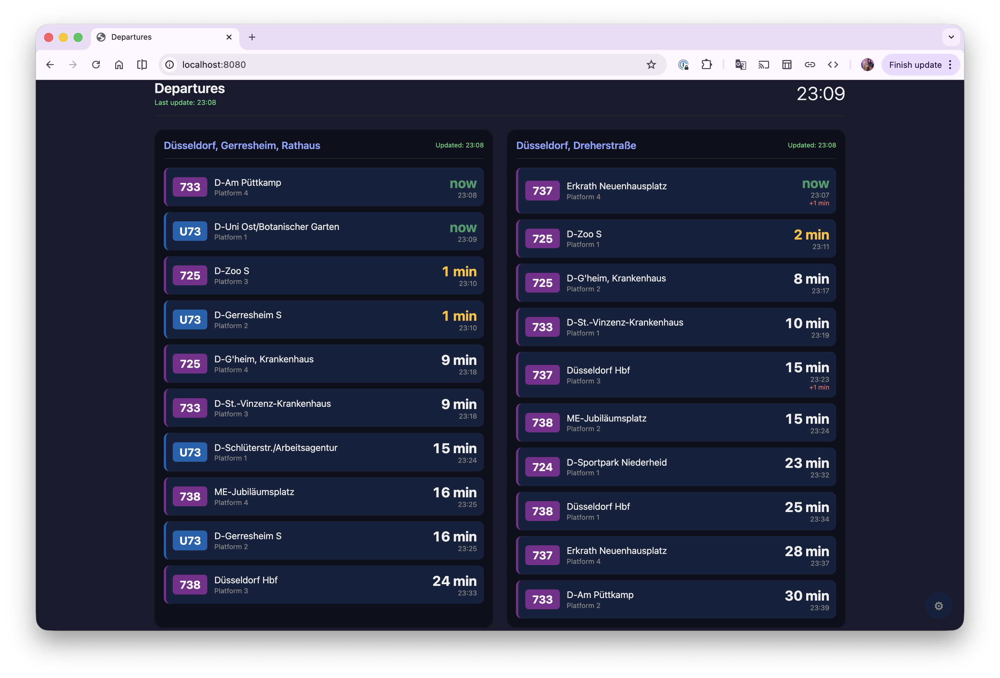

# VRR Departure Board

A self-hosted departure board for VRR (Düsseldorf / NRW) public transport. Perfect for displaying on an old iPad or any always-on screen.



## Features

- **Multiple stops** - Monitor 2, 3, or more stops simultaneously
- **Real-time data** - Live delays from official VRR EFA API
- **Auto-refresh** - Configurable interval (default 30 seconds)
- **Dark theme** - Optimized for always-on displays
- **iPad-friendly** - Supports "Add to Home Screen" for full-screen mode
- **No API key required** - Uses public VRR endpoint
- **Persistent config** - Settings saved in browser localStorage

## Quick Start

### Docker (recommended)

```bash
docker-compose up -d
```

Then open http://localhost:8080

### Node.js

```bash
npm install
npm start
```

Then open http://localhost:8080

## Configuration

1. Open the board in your browser
2. Click the ⚙ gear icon (bottom right)
3. Click **+ Add Stop**
4. Search for your stop (e.g., "Düsseldorf Hbf")
5. Click on a result to select it
6. Optionally set a custom display label
7. Repeat for additional stops
8. Click **Save**

## iPad Kiosk Setup

1. Open the URL in Safari
2. Configure your stops via the settings gear
3. Tap Share → **Add to Home Screen**
4. Open from home screen (runs full-screen)
5. Optional: Enable **Guided Access** (Settings → Accessibility) for true kiosk mode

## Project Structure

```
departure-board/
├── public/
│   └── index.html      # Frontend (HTML/CSS/JS)
├── server.js           # Express backend (API proxy)
├── package.json
├── Dockerfile
├── docker-compose.yml
└── README.md
```

## Why a Backend?

The VRR EFA API doesn't support CORS, so browsers block direct requests. The Node.js server acts as a simple proxy:

- `GET /api/stops?q=query` → searches for stops
- `GET /api/departures?stop=id` → fetches departures

## Supported Stops

Works with any stop in the VRR network:
- Düsseldorf Hbf
- Düsseldorf Bilk S
- Düsseldorf Heinrich-Heine-Allee
- Essen Hbf
- Köln Hbf
- ... and thousands more

## Environment Variables

| Variable | Default | Description |
|----------|---------|-------------|
| `PORT`   | `8080`  | Server port |

## Customization

Edit `public/index.html` to:
- Change colors (CSS variables at top)
- Adjust grid layout for your screen
- Filter specific lines
- Add walking time offset

## Tech Stack

- **Frontend**: Vanilla HTML/CSS/JS (no build step)
- **Backend**: Node.js + Express
- **API**: VRR EFA (public, no auth)

## License

MIT
